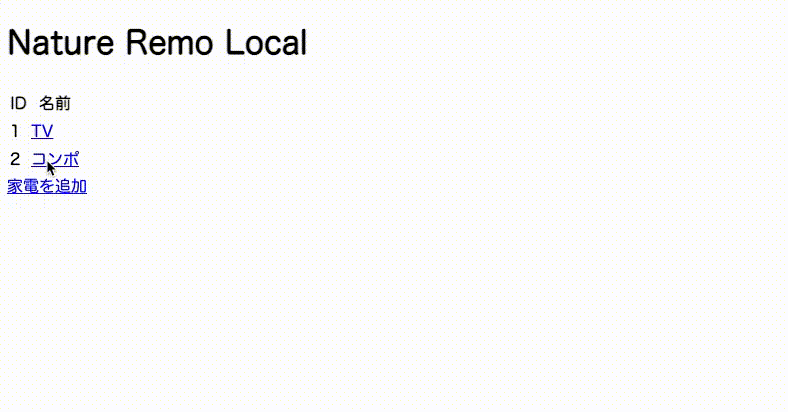

# Nature Remo Local

LAN内だけでNature Remoを操作できるRailsアプリケーションです。[Nature Remo Local API](https://local-swagger.nature.global/)を利用しています。



## Installation

[リファレンス](https://local-swagger.nature.global/)に従ってNature Remoのホスト名もしくはIPアドレスを調べ、環境変数に設定しておきます。

```
$ export NATURE_REMO_HOST=192.168.XX.XX
# OR
$ export NATURE_REMO_HOST=Remo-XXXXXX.local
```

```
$ bundle install
$ bin/rails db:setup
$ bin/rails server
```

### Requirement

- Nature Remo ファームウェア
    - `Remo/1.0.79-gbbcb0e8`
- OS
    - Raspberry Pi 4：`Raspbian 10.6`
    - macOS：`Mojave 10.14.6`
- PostgreSQL
    - Raspberry Pi 4：`psql (PostgreSQL) 11.9 (Raspbian 11.9-0+deb10u1)`
    - macOS：`psql (PostgreSQL) 13.1`
- Ruby 2.6.6
- Rails 6.0.3.4

## Usage

- サーバを起動し、トップページにアクセス
- 家電を追加
- 家電にボタンを追加
    - リモコンをNature Remoに近づけて追加したいボタンを押下したあと、「読込」ボタンをクリックすると、読み取った信号が「信号」欄に表示され追加することができます。
- 追加したボタンを家電の画面でクリックすると、Nature Remoから赤外線信号が送信されます
